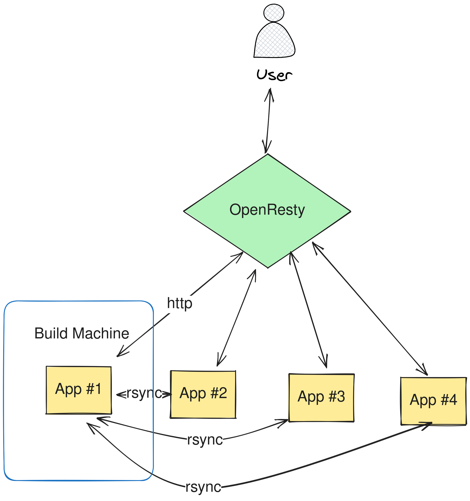

# Optimize our time to ship features Challange

"In a world of hulk stacks we can have a pool of servers that hold the app to assure a high availability, deploying the app to this pool is one of the common challenges in site reliability engineering.

We would like to optimize the deploy-time of the app by building it first on one machine then rsync the finale build to other stack machines."

## Requirements

-   Docker
-   Docker Compose
-   Ansible
-   OpenResty Docker Image
-   PHP-CLI Docker Image

## Environment



all components are docker containers, we chose app #1 (app_container_1) as the build machine

The project is structured as follows

```
.
├── ansible
│   ├── bootstrap-env.yml
│   ├── config
│   ├── release.yml
│   └── youcan
├── app
│   └── index.php
├── arch-env.png
├── docker-compose.yml
├── Dockerfile
├── nginx
│   ├── Dockerfile
│   └── proxy.conf
└── README.md
```

-   in the **ansbile** dir, we have 2 playbooks, the order of running these two is important, first we run the **bootstrap-env.yml** playbook, then when we have changes mad in app we run the **release.yml** playbook, note that we have also other file like config which is SSH config file for automatic ssh access when using `rsync`
-   in the **app** dir, we have the source code of the application.
-   the **nginx** dir, holds the configuration for reverse proxy of openresty container named **proxy.conf** and the Dockerfile to build the appropiate image.
-   and in the dir we have **docker-compose.yml** file that have all the 4 app services and the openresty reversy proxy configurated and attached to the same network so that they can communicate.

## Steps

-   Clone repo to you local machine
-   run `docker-compose up -d` command
-   make sure you are in the ansible dir
-   run the boostrapping script `ansbile-playbook bootstrap-env.yml`
